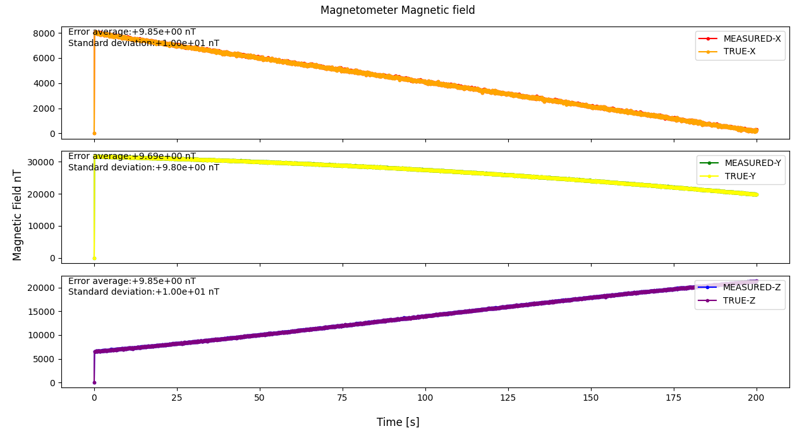

# Specification for Magnetometer class

## 1.  Overview
### 1. functions 
- The `Magnetometer` class simulates a magnetometer.
- The `Magnetometer` class calculates and returns the observed magnetic field with noise.

### 2. files
- `magnetometer.cpp, magnetometer.hpp`: Definitions and declarations of the class
- `magnetometer.ini`: Initialization file
- `plot_magnetometer.py`: An example of a Python script to plot magnetometer output

### 3. how to use
- Set the parameters in `magnetometer.ini`.
  - `quaternion_b2c`: Frame conversion quaternion from body to component frame.
  - Other parameters
    - Parameters for the `Component` class
    - Parameters for the `Sensor` class
    - Parameters for the `PowerPort` class
- Create an instance by using the initialization function `InitMagnetometer`
- Use the `Get*` function to get magnetic field information.

## 2. Explanation of Algorithm 

### 1. MainRoutine
#### 1. Overview
- The `MainRoutine` function converts the magnetic field coordinate from the body to the component and adds noises using the feature of the `Sensor` class.

#### 2. Inputs and Outputs
- NA

#### 3. Algorithm
- NA

## 3. Results of verifications
- The output result obtained by the default initial settings.

