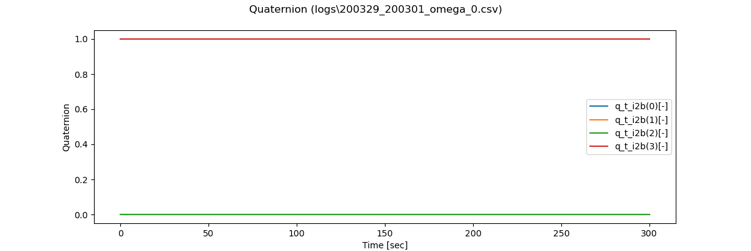
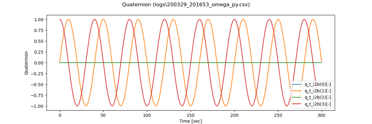
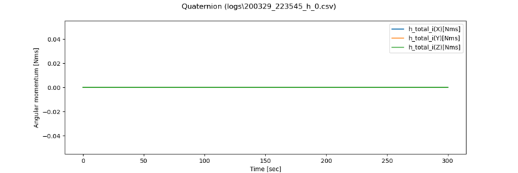
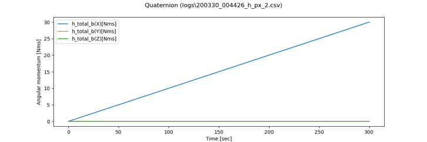
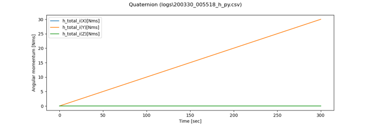
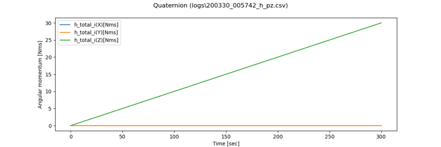

# Specification for Attitude Dynamics with RK4 propagation method

## 1.  Overview

1. functions
   - This class has the function to propagate the attitude motion equation that forms the basis of the attitude simulator.
   - Use the 4th Runge-Kutta equation for the propagation or set the attitude as determined values.
   - This class also calculates the angular momentum.

2. files
   - `src/dynamics/attitude/attitude.hpp, .cpp`
     - Definition of `Attitude` base class
   - `src/dynamics/attitude/attitude_rk4.hpp, .cpp`
     - Normal free motion dynamics propagator `AttitudeRk4` class is defined here.
   - `src/dynamics/attitude/initialize_attitude.hpp, .cpp`
	   - Make an instance of `Attitude` class.	
   - `sample_satellite.ini` : Initialization file

3. how to use
   - Set the parameters in `sample_satellite.ini` or user defined satellite initialize file
     - If you want to use RK4 as attitude dynamics, please set  `propagate_mode = RK4` at the `[ATTITUDE]` section in the `sample_satellite.ini` file.
     - Select `initialize_mode` at the `[ATTITUDE]` section in the `sample_satellite.ini` file.
       - `initialize_mode = MANUAL`
         - Initial attitude is defined by `initial_quaternion_i2b` and `initial_angular_velocity_b_rad_s`.
       - `initialize_mode = CONTROLLED`
         - Initial attitude is defined by [CONTROLLED_ATTITUDE] settings.
   - Create an instance by using initialization function `InitAttitude`
   - Execute attitude propagation by `Propagate` function
   - Use `Get*` function to get attitude information.
     

## 2. Explanation of RK4 Algorithm 

1. `Propagate` function
   1. overview
      - This function manages the timings of `RungeKuttaOneStep` function, which calculates the attitude dynamics and kinematics by the 4th Runge-Kutta method.

   2. inputs and outputs
      - input
         - (double) `end_time_s`: Time incremented in the main function
      - output
         - (void)

   3. algorithm  
      There are two-time steps definition related to attitude propagation.
      1. Time incremented in the main function
         - This time step decides the timing to update the torque input values by disturbances and actuator outputs.
         - The step is defined as the variable `propagation_step_s_` in the `simulation_time` class.
      2. Time incremented in Propagate function
         - This time step is much shorter than the time step in the main function. 
         - This step determines the accuracy of the attitude propagation.
         - The step is defined as the variable `propagation_step_s_` in the `Attitude` class.

   There is a `while loop` in the `Propagate` function, in which Runge-Kutta integration is performed. In addition, there is only one Runge-Kutta integration function outside the while loop, but this is for adjusting the time-lapse.

2. `RungeKuttaOneStep` function

   1. overview  
      Calculate the attitude propagation by 4th Runge-Kutta integration.

   2. inputs and outputs
      - input
        - (double) t: Elapsed time from the time when the `Propagate` function is called.
        - (double) dt: The duration for the attitude propagation

   3. algorithm  
      If the differential equation (1) is given, the state quantity in $n+1$ step can be calculated as (2).

      ```math
      \begin{align}
        \hat{\boldsymbol{x}} &= \boldsymbol{f}(\boldsymbol{x},t)\\
        \boldsymbol{x_{n+1}} &= \boldsymbol{x_{n}} + \cfrac{\Delta t}{6}(\boldsymbol{k_1}+2\boldsymbol{k_2}+2\boldsymbol{k_3}+\boldsymbol{k_4})
      \end{align}
      ```
      where $\Delta t$ is a time step, which meets the equation (3).

      ```math
      t_{n+1} = t_{n} + \Delta t
      ```

      $k_i \, (i=1,2,3,4)$, which has the same number of elements, can be calculated as the equations (4).

      ```math
      \begin{align}
        \boldsymbol{k_{1}} &= \boldsymbol{f}(\boldsymbol{x_n},t_n) \\
        \boldsymbol{k_{2}} &= \boldsymbol{f}\left(\boldsymbol{x_n}+\frac{\Delta t}{2} \boldsymbol{k_1},t_n+\frac{\Delta t}{2} \right) \\
        \boldsymbol{k_{3}} &= \boldsymbol{f}\left(\boldsymbol{x_n}+\frac{\Delta t}{2} \boldsymbol{k_2},t_n+\frac{\Delta t}{2} \right)  \\
        \boldsymbol{k_{4}} &= \boldsymbol{f}\left(\boldsymbol{x_n} + \Delta t \boldsymbol{k_3},t_n+\Delta t \right)
      \end{align}
      ```

      In this attitude propagation, the quantity of state $\boldsymbol{x}$ consists of 7 elements, including `Quaternion_i2b` and angular velocity $\boldsymbol{\omega}_b$.

      ```math
      \begin{align}
        \boldsymbol{\omega}_b &= [{\omega}_{bx} \, {\omega}_{by} \, {\omega}_{bz}]^T \\
        \boldsymbol{q}_{i2b} &= [q_x \, q_y \, q_z \, q_w]^T \\
        \boldsymbol{x} &= [\boldsymbol{\omega}_b, \boldsymbol{q}_{i2b}]^T
      \end{align}
      ```

   4. note  
      The one that solves the upper differential equation is implemented in Library.

3. `AttitudeDynamicsAndKinematics` function

   1. overview  
      The equation of attitude motion is described in this function.

   2. inputs and outputs
      - input
         - (Vector<7>) x: Quantity of state
         - (double) t: Elapsed time from the time when the `Propagate` starts
      - output
         - (Vector<7>) dxdt: Differentiation of quantity of state.

   3. algorithm  
      Equation of attitude motion is calculated as the equation (6), which is written in Chapter 6 of Reference 1,

       ```math
       \dot{\boldsymbol{\omega}}_b = \boldsymbol{I}_b^{-1}(\boldsymbol{T}_b - \boldsymbol{\omega}_b \times \boldsymbol{h}_b)
       ```

      where $\boldsymbol{\omega}_b$[rad/s] is angular velocity in the body-fixed coordinate, $\boldsymbol{I}_b$[kgm$^2$] is inertia tensor of the satellite, $\boldsymbol{T}_b$[Nm] is torque in the body-fixed coordinate, $\boldsymbol{h}_b$[Nms] is angular momentum of the satellite in the body-fixed coordinate.
      Quaternion_i2b is calculated from the kinematics equation (7). This equation is executed in ` CalcAngularVelocityMatrix` function.

       ```math
       \dot{\boldsymbol{q}}_{i2b} = \cfrac{1}{2}
       \begin{bmatrix}
         0                &  {\omega}_{bz} & -{\omega}_{by} & {\omega}_{bx} \\
         - {\omega}_{bz} & 0              &  {\omega}_{bx} & {\omega}_{by} \\
            {\omega}_{by} & -{\omega}_{bx} & 0              & {\omega}_{bz} \\
         - {\omega}_{bx} & -{\omega}_{by} & -{\omega}_{bz} & 0
       \end{bmatrix}
       \boldsymbol{q}_{i2b}
       ```

## 3. Results of verifications

1. verification of kinematics equation
   1. overview
      - Check that the integral propagation of kinematics equations is performed correctly

   2. conditions for the verification
      - attitude_integral_step_s : 0.001
      - simulation_step_s: 0.1
      - simulation_duration_s: 300
      - Inertia tensor: diag [0.17, 0.1, 0.25]
      - Initial quaternion_i2b: [0,0,0,1]
      - Initial torque: [0,0,0]
      - Initial angular velocity: Set by each case
      - Disturbance torque: All Disable

   3. results
      - Initial angular velocity = [0,0,0]
  
         

      - Initial angular velocity = [0.314, 0, 0] rad/s
      
         
      
      - Initial angular velocity = [0, 0.314, 0] rad/s
      
         
      
      - Initial angular velocity = [0, 0, 0.314] rad/s
    
         
      
      - Initial angular velocity = [0, 0, -0.314] rad/s
      
        

2. verification of dynamics equation
   1. overview
      Confirm that the integral propagation of the dynamics equation is performed correctly

   2. conditions of the verification
      - attitude_integral_step_s : 0.001
      - simulation_step_s: 0.1
      - simulation_duration_s: 300
      - Inertia tensor: diag[0.17, 0.1, 0.25]
      - Initial Quaternion_i2b: [0,0,0,1]
      - Initial torque: Set by each case
      - Initial angular velocity: [0,0,0]
      - Disturbance torque: All Disable

   3. results
      - Add constant torque: [0,0,0] Nm
         - body frame
         

         - inertial frame
         

      - Add constant torque = [0.1,0,0] Nm
           -  body frame
               

           - inertial frame
               
      - Add constant torque = [0,0.1,0] Nm
        -  body frame
         

        - inertial frame
         

      - Add constant torque = [0,0,0.1] Nm
        - body frame
         

        - inertial frame
         

3. validation of attitude dynamics propagation time step
   1. overview
      Validate the time step of the attitude dynamics propagation

   2. conditions of the verification
      - attitude_integral_step_s : 0.001 / 0.01
      - simulation_step_s: 0.1
      - simulation_duration_s: 300
      - Inertia tensor: diag[0.17, 0.1, 0.25]
      - Initial Quaternion_i2b: [0,0,0,1]
      - Initial torque: [0,0,0]
      - Initial angular velocity: [0,0,0]
      - Disturbance torque: All Disable

   3. results
      - No difference between two results in attitude_integral_step_s = 0.001 / 0.01 sec. 

## 4. References
1. 狼, 冨田, 中須賀, 松永, 宇宙ステーション入門第二版, 東京大学出版会, 2008. (Written in Japanese)
